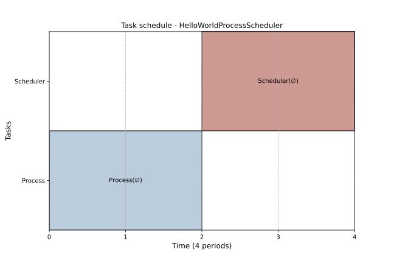

[](https://www.codacy.com/gh/tpaviot/ProcessScheduler/dashboard?utm_source=github.com&amp;utm_medium=referral&amp;utm_content=tpaviot/ProcessScheduler&amp;utm_campaign=Badge_Grade)
[](https://codecov.io/gh/tpaviot/ProcessScheduler)
[](https://dev.azure.com/tpaviot/ProcessScheduler/_build?definitionId=9)
[](https://mybinder.org/v2/gh/tpaviot/ProcessScheduler/HEAD?filepath=examples-notebooks)
[](https://processscheduler.readthedocs.io/en/latest/?badge=latest)

# ProcessScheduler
A python library to compute resource-constrained task schedules.

## About
The computation is based on a set of constraints expressed under the form of first-order logic assertions. Problem solving is performed by the [Z3Prover](https://github.com/Z3Prover/z3).

## Helloworld

```python
import processscheduler as ps
# a simple problem, without horizon (solver will find it)
pb = ps.SchedulingProblem('HelloWorldProcessScheduler')

# add two tasks
task_hello = ps.FixedDurationTask('Process', duration=2)
task_world = ps.FixedDurationTask('Scheduler', duration=2)

# precedence constraint: task_world must be scheduled
# after task_hello
c1 = ps.TaskPrecedence(task_hello, task_world, offset=0)
pb.add_constraint(c1) # explicitly add this constraint to the problem

# solve
solver = ps.SchedulingSolver(pb)
solution = solver.solve()

# displays solution, ascii or matplotlib gantt diagram
solution.render_gantt_matplotlib()
```



## Features

*   tasks: ZeroDurationTask, FixedDurationTask, VariableDurationTask, work amount
*   resources: Worker, SelectWorkers, cost_per_period, productivity
*   task constraints: TasksPrecedence, TasksStartSynced, TasksEndSynced, TaskStartAt, TaskEndAt, TaskStartAfterStrict, TaskStartAfterLax, TaskEndBeforeStrict, TaskEndBeforeLax
*   resource constraints: AllSameSelected, AllDifferentSelected
*   first-order-logic operations (not, or, xor, and, implies, if/then/else) between task or resource constraints,
*   objectives: makespan, flowtime, earliest, latest

## Installation

Using pip
---------

```bash
pip install ProcessScheduler
```

Development version
-------------------

Create a local copy of this repository:
```bash
git clone https://github.com/tpaviot/ProcessScheduler
```

Then install the development version:

```bash
cd ProcessScheduler
pip install -e .
```

## Documentation

Documentation can be found at https://processscheduler.readthedocs.io/

## Jypter notebooks

There are some [Jupypter notebooks](https://github.com/tpaviot/ProcessScheduler/tree/master/example-notebooks). They can be executed online at [myBinder.org](https://mybinder.org/v2/gh/tpaviot/ProcessScheduler/HEAD?filepath=example-notebooks)

## Code quality

ProcessScheduler uses the following tools/methods to ensure code quality:

*   unittests suite,
*   code coverage (coverage.py, codecov.io),
*   continuous-integration at MS azure,
*   static code analysis (codacy).

## License/Author

ProcessScheduler is distributed under the terms of the GNU General Public License v3 or (at your option) any later version. It is currently developed and maitained by Thomas Paviot (tpaviot@gmail.com).
