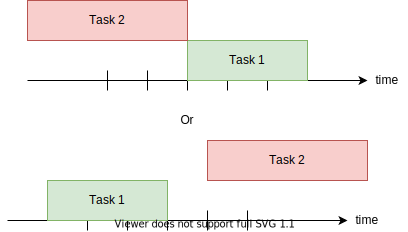

Task Constraints
================

ProcessScheduler provides a set of ready-to-use temporal task constraints. They allow expressing common rules such as "the task A must start exactly at the instant 4", "the task B must end at the same time than the task C ends", "the task C must be scheduled exactly 3 periods after the task D is completed" etc.

There are a set of builtin ready-to-use constraints, listed below.

.. note::

	Naming convention: if the class name starts with *Task** then the constraint applies to one single task, if the class name starts with *Tasks** it applies to 2 or more task instances.

- :class:`TaskPrecedence`

- :class:`TasksStartSynced`: takes two parameters :attr:`task_1` and :attr:`task_2` such as the schedule must satisfy the constraint :math:`task_1.start = task_2.start`

.. image:: img/TasksStartSynced.svg
    :align: center
    :width: 90%

- :class:`TasksEndSynced`: takes two parameters :attr:`task_1` and :attr:`task_2` such as the schedule must satisfy the constraint :math:`task_1.end = task_2.end`

.. image:: img/TasksEndSynced.svg
    :align: center
    :width: 90%

- :class:`TasksDontOverlap`: takes two parameters :attr:`task_1` and :attr:`task_2` such as the task_1 ends before the task_2 istarted or the opposite (task_2 ends before task_1 is started)

- :class:`TaskStartAt`: takes two parameters :attr:`task` and :attr:`value` such as the task starts exactly at the instant *value* :math:`task.start = value`

- :class:`TaskStartAfterStrict`: takes two parameters :attr:`task` and :attr:`value` such as the task starts strictly after the instant *value* :math:`task.start > value`

- :class:`TaskStartAfterLax`: takes two parameters :attr:`task` and :attr:`value` such as the task starts after the instant *value* :math:`task.start >= value`

- :class:`TaskEndAt`: takes two parameters :attr:`task` and :attr:`value` such as the task ends exactly at the instant *value* :math:`task.end = value`

- :class:`TaskEndBeforeStrict`: takes two parameters :attr:`task` and :attr:`value` such as the task ends strictly before the instant *value* :math:`task.end < value`

- :class:`TaskEndBeforeLax`: takes two parameters :attr:`task` and :attr:`value` such as the task ends before the instant *value* :math:`task.end <= value`
