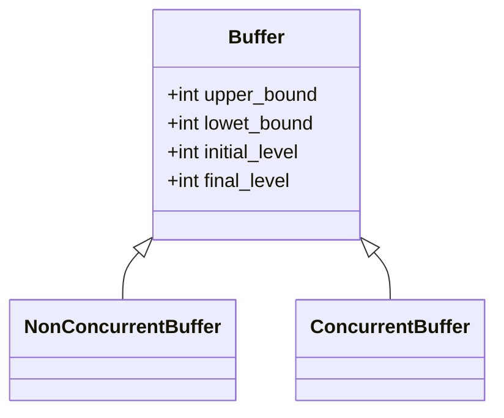

A `Buffer` is an object in a scheduling environment where tasks can load or unload a finite number of items. Buffers are essential for managing the flow of discrete quantities in a production or processing system. These can be:

* **Physical Discrete Quantities**: Such as mechanical parts, bottles of water, steel structural pieces.

* **Immaterial Discrete Quantities**: Such as currencies (dollars, euros) representing a budget or treasury, or digital items like pdf documents.

## Types of Buffers



1. **NonConcurrentBuffer**: This buffer type ensures exclusive access, meaning only one task can load or unload at a given time. The buffer becomes available to another task only after the current task is completed. This is akin to the blocking phenomenon in flow shops, where a task remains on a machine until the buffer ahead is available.

2. **ConcurrentBuffer**: This buffer allows simultaneous access by multiple tasks, reflecting a more flexible and potentially higher throughput environment, as seen in flexible flow lines.

## Buffer Attributes

* `initial_level`: Represents the number of items in the buffer at time `t=0`.

* `final_level`: Represents the number of items in the buffer at schedule `t=horizon`.

* `lower_bound`: An optional parameter setting the minimum number of items in the buffer. If the buffer level falls below this, the problem is unsatisfiable. This parameter can be crucial in settings where maintaining a minimum inventory level is essential for continuous operation.

* `upper_bound`: An optional parameter representing the maximum buffer capacity. Exceeding this limit makes the problem unsatisfiable. This reflects the physical limitations of buffer spaces in industrial settings, especially with larger items.

Both `initial_level`, `final_level`, `lower_bound` and `upper_bound` are optional parameters.

!!! note

    If `lower_bound` (resp. `upper_bound`) is specified, the solver will schedule tasks to that the buffer level is never lower (resp. greater) than the lower (resp. upper) bound.

A `NonConcurrentBuffer` can be created as follows:

``` py
buff1 = ps.NonConcurrentBuffer(name="Buffer1")
buff2 = ps.NonConcurrentBuffer(name="Buffer2", initial_level=10)
buff3 = ps.NonConcurrentBuffer(name="Buffer3", lower_bound=0)
buff4 = ps.NonConcurrentBuffer(name="Buffer4", upper_bound=20)
buff5 = ps.NonConcurrentBuffer(name="Buffer5",
                               initial_level=3,
                               lower_bound=0, 
                               upper_bound=10)
```

## Loading and unloading buffers

Buffers are loaded/unloaded by dedicate tasks.

* **Unloading Tasks**: These tasks remove a specified quantity at the task start time, mimicking the immediate release of resources upon task commencement.

* **Loading Tasks**: These tasks add to the buffer upon task completion, reflecting the production or processing output.

Load/Unload constraints can be created as follows:

``` py
c1 = ps.TaskUnloadBuffer(task_1, buffer, quantity=3)
c2 = ps.TaskLoadBuffer(task_2, buffer, quantity=6)
```

!!! note

    There is no limitation on the number of buffers and/or buffer constraints.

!!! note

    Unloading tasks remove quantities at the task start time, while loading tasks add to the buffer at task completion time.

### Example

Let's take an example where a task `T1` uses a machine `M1` to manufacture a part (duration time for this task is 4). It takes one raw part in a `Buffer1` at the start time and loads the `Buffer2` at completion time.

``` py
import processscheduler as ps

pb = ps.SchedulingProblem(name="BufferExample", horizon=6)
machine_1 = ps.Worker(name="M1")
task_1 = ps.FixedDurationTask(name="T1", duration=4)
ps.TaskStartAt(task=task_1, value=1)
task_1.add_required_resource(machine_1)

# the buffers
buffer_1 = ps.NonConcurrentBuffer(name="Buffer1", initial_level=5)
buffer_2 = ps.NonConcurrentBuffer(name="Buffer2", initial_level=0)

# buffer constraints
bc_1 = ps.TaskUnloadBuffer(task=task_1, buffer=buffer_1, quantity=1)
bc_2 = ps.TaskLoadBuffer(task=task_1, buffer=buffer_2, quantity=1)

# solve and render
solver = ps.SchedulingSolver(problem=pb)
solution = solver.solve()
ps.render_gantt_matplotlib(solution)
```

The graphical output shows the Gantt chart and the evolution of the buffer states along the time line.

{ width="100%" }
