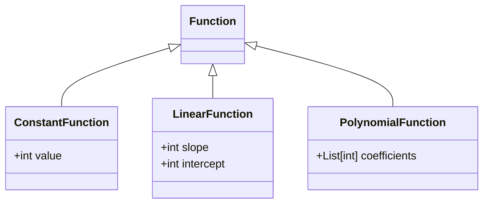
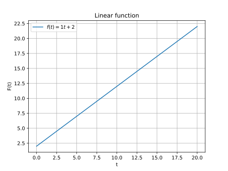

# Functions

The `Function` class and its derivatives allow representing a mathematical function that can be used for cost or penalty computation.



## ConstantFunction

$$ f(x) = K, \forall x \in \mathbb{N}$$

in python

```py
my_constant_function = ps.ConstantFunction(value=55)
ps.plot_function(my_constant_function)
```


## LinearFunction

$$ f(x) = s \times x + i, \forall x \in \mathbb{N}$$

in python

```py
my_linear_function = ps.LinearFunction(slope=1, intercept=2)
ps.plot_function(my_linear_function)
```



## PolynomialFunction

$$f(x)={a_n}x^n + {a_{n-1}}x^{n-1} + ... + {a_i}x^i + ... + {a_1}x+{a_0}$$

```py
my_polynomial_function = ps.PolynomialFunction(coefficients=[1, 2, 3, 4])
ps.plot_function(my_polynomial_function)
```


