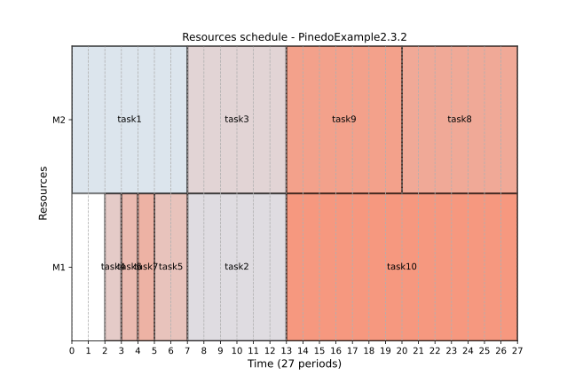

# Scheduling. Theory, Algorithms, and Systems

<a target="_blank" href="https://colab.research.google.com/github/tpaviot/ProcessScheduler/blob/master/examples-notebooks/pinedo.ipynb">
  
</a>

This section presents examples from [Michael Pinedo](https://wp.nyu.edu/michaelpinedo/)'s renowned book:

Pinedo, Michael. L. (2012) "Scheduling. Theory, Algorithms, and Systems". 4th edition. Springer New York, NY. ISBN  doi: [10.1007/978-1-4614-2361-4](https://doi.org/10.1007/978-1-4614-2361-4)

## Example 2.3.2 (A Scheduling Anomaly)

Consider an instance of P2 | prec | Cmax with 10 jobs and the following
processing times.


| jobs n° | pj |
|---------|----|
| 1 | 8 |
| 2 | 7 |
| 3 | 7 |
| 4 | 2 |
| 5 | 3 |
| 6 | 2 |
| 7 | 2 |
| 8 | 8 |
| 9 | 8 |
| 10 | 15 |

The Python code to represent jobs and durations is as follows:

``` py
problem = ps.SchedulingProblem(name="PinedoExample2.3.2")

durations = [8, 7, 7, 2, 3, 2, 2, 8, 8, 15]
jobs = []

i = 1
for pj in durations:
    jobs.append(ps.FixedDurationTask(name=f"task{i}", duration=pj))
    i +=1
```

All tasks can be processed by two machines:

``` py

# two machines
machine_1 = ps.Worker(name="M1")
machine_2 = ps.Worker(name="M2")

# resource assignment: each job can be processed eithe by machine_1
# or machine_2
for j in jobs:
    j.add_required_resource(ps.SelectWorkers(list_of_workers=[machine_1, machine_2]))
```

The precedence relationships are defined by the following graph:

{ width="300" }

In python, we define these precedences as follows:

``` py
# precedences
precs_graph = [(1, 2), (1, 3), (2, 10), (3, 10),
               (5, 3),
               (4, 5), (4, 6), (5, 8), (6, 7), (7, 9), (5, 9), (7, 8)]

for i, j in precs_graph:
    ps.TaskPrecedence(task_before=jobs[i-1], task_after=jobs[j-1])
```

The non-delay schedule ensures that no machine is kept idle while an operation is waiting for processing. In other words, all tasks assigned to any resource must be contiguous.

``` py
# non delay schedule
ps.ResourceNonDelay(resource=machine_1)
ps.ResourceNonDelay(resource=machine_2)
```

Finally, we solve for optimizing the total completion time and render the Gantt chart:

``` py
ps.ObjectiveMinimizeMakespan()
solver = ps.SchedulingSolver(problem=problem)
solution = solver.solve()
ps.render_gantt_matplotlib(solution)
```

The obtained schedule is shown below:

{ width="100%" }

This result is similar to the solution presented in the book, with a makespan of 31.

{ width="100%" }

Now, let's reduce each of the ten processing times by one time unit:

``` py
durations = [7, 6, 6, 1, 2, 1, 1, 7, 7, 14]
```

We solve the problem in the same way and obtain the following schedule:
{ width="100%" }

Here the conclusion is slightly different from the one from Pinedo's book, where "one would expect that, if each one of the ten processing times is reduced by one time unit, the makespan would be less than 31. However, requiring the schedule to be non-delay results in the schedule depicted in [..] with a makespan of 32". Our solution, however, has a makespan of 27.

With 3 machines and the original settings, we get the following schedule:

{ width="100%" }

This also conflicts with Pinedo's conclusion, as he claims the makespan is now 36, whereas our solution results in a makespan of only 30.

## Example 3.2.5 (Minimizing Maximum Lateness)

Consider the following 4 jobs.

| jobs | $p_j$ | $r_j$ | $d_j$ |
| ---- | -- | -- | -- |
| 1    | 4  | 0  | 8 |
| 2    | 2  | 1  | 12 |
| 3    | 6  | 3  | 11 |
| 4    | 5  | 5  | 10 |

This can be represented by the following Python code:

```py
problem = ps.SchedulingProblem(name="PinedoExample3.2.5")

J1 = ps.FixedDurationTask(
    name="J1", duration=4, release_date=0, due_date=8, due_date_is_deadline=False
)
J2 = ps.FixedDurationTask(
    name="J2", duration=2, release_date=1, due_date=12, due_date_is_deadline=False
)
J3 = ps.FixedDurationTask(
    name="J3", duration=6, release_date=3, due_date=11, due_date_is_deadline=False
)
J4 = ps.FixedDurationTask(
    name="J4", duration=5, release_date=5, due_date=10, due_date_is_deadline=False
)

M1 = ps.Worker(name="M1")
J1.add_required_resource(M1)
J2.add_required_resource(M1)
J3.add_required_resource(M1)
J4.add_required_resource(M1)
```

The maximum lateness optimization is achieved using:

``` py
lateness_indicator = ps.IndicatorMaximumLateness()
ps.ObjectiveMinimizeIndicator(target=lateness_indicator, weight=1)
```

After solving, this gives the following Gantt chart, confirming "that schedule 1, 3, 4, 2 has to be optimal".

{ width="100%" }

## Example 3.3.3 (Minimizing Number of Tardy Jobs)

Consider the following 5 jobs.

| jobs | $p_j$ | $d_j$ |
| ---- | -- | -- |
| 1    | 7  | 9  |
| 2    | 8  | 17 |
| 3    | 4  | 18 |
| 4    | 6  | 19 |
| 5    | 6  | 21 |

The implementation in Python is as follows:

```py
problem = ps.SchedulingProblem(name="PinedoExample3.3.3")

J1 = ps.FixedDurationTask(name="J1", duration=7, due_date=9, due_date_is_deadline=False)
J2 = ps.FixedDurationTask(
    name="J2", duration=8, due_date=17, due_date_is_deadline=False
)
J3 = ps.FixedDurationTask(
    name="J3", duration=4, due_date=18, due_date_is_deadline=False
)
J4 = ps.FixedDurationTask(
    name="J4", duration=6, due_date=19, due_date_is_deadline=False
)
J5 = ps.FixedDurationTask(
    name="J5", duration=6, due_date=21, due_date_is_deadline=False
)

M1 = ps.Worker(name="M1")

for j in [J1, J2, J3, J4, J5]:
    j.add_required_resource(M1)

ind = ps.IndicatorNumberOfTardyTasks()
ps.ObjectiveMinimizeIndicator(target=ind, weight=1)
```

The resulting schedule

{ width="100%" }


confirms that "The optimal schedule is 3, 4, 5, 1, 2 with $\sum{U_j = 2}$" and "Note also that there may be many optimal schedules".

## Example 3.4.5 (Minimizing Total Tardiness)

Consider the following 5 jobs.

| jobs | $p_j$ | $d_j$ |
| ---- | -- | -- |
| 1    |121  | 260  |
| 2    | 79  | 266 |
| 3    | 147  | 266 |
| 4    | 83  | 336 |
| 5    | 130  | 337 |

According to Pinedo, the optimal is "370. Two optimal sequences are 1, 2, 4, 5, 3 and 2, 1, 4, 5, 3", confirmed by the following simulation:

``` py
problem = ps.SchedulingProblem(name="PinedoExample3.4.5")

J1 = ps.FixedDurationTask(name="J1", duration=121, due_date=260, due_date_is_deadline=False)
J2 = ps.FixedDurationTask(
    name="J2", duration=79, due_date=266, due_date_is_deadline=False
)
J3 = ps.FixedDurationTask(
    name="J3", duration=147, due_date=266, due_date_is_deadline=False
)
J4 = ps.FixedDurationTask(
    name="J4", duration=83, due_date=336, due_date_is_deadline=False
)
J5 = ps.FixedDurationTask(
    name="J5", duration=130, due_date=337, due_date_is_deadline=False
)

M1 = ps.Worker(name="M1")

for j in [J1, J2, J3, J4, J5]:
    j.add_required_resource(M1)

ind = ps.IndicatorTardiness()
ps.ObjectiveMinimizeIndicator(target=ind, weight=1)

solver = ps.SchedulingSolver(problem=problem, debug=False)
solution = solver.solve()
ps.render_gantt_matplotlib(solution)
```

{ width="100%" }

## Example 3.6.3 (Minimizing Total Weighted Tardiness)

Consider the following 4 jobs.

| jobs | $w_j$ | $p_j$ | $d_j$ |
| ---- | -- | -- |---
| 1    |4 | 12  | 16  |
| 2    | 5  | 8 | 26 |
| 3    | 3  | 15 | 25 |
| 4    | 5  | 9 | 27 |

Pinedo states that "It turns out that the best schedule reachable from this node is 1, 2, 4, 3 with an objective value of 64."

However, our simulation gives a different result (the total weighted tardiness is 67):
``` py
problem = ps.SchedulingProblem(name="PinedoExample3.6.3")
J1 = ps.FixedDurationTask(
    name="J1", priority=4, duration=12, due_date=16, due_date_is_deadline=False)
J2 = ps.FixedDurationTask(
    name="J2", priority=5, duration=8, due_date=26, due_date_is_deadline=False
)
J3 = ps.FixedDurationTask(
    name="J3", priority=3, duration=15, due_date=25, due_date_is_deadline=False
)
J4 = ps.FixedDurationTask(
    name="J4", priority=5, duration=9, due_date=27, due_date_is_deadline=False
)

M1 = ps.Worker(name="M1")

for j in [J1, J2, J3, J4]:
    j.add_required_resource(M1)

ind = ps.IndicatorTardiness()
ps.ObjectiveMinimizeIndicator(target=ind, weight=1)

solver = ps.SchedulingSolver(problem=problem)
solution = solver.solve()
ps.render_gantt_matplotlib(solution)

```

{ width="100%" }

## Example 4.1.5 (Minimizing Total Earliness and Tardiness with Tight Due Date)

Consider the following example with 6 jobs and due date $d = 180$.

| jobs | $p_j$ |
| ---- | -- |
| 1    |106 |
| 2    | 100 |
| 3    |96  | 
| 4    | 22  | 
| 5    | 20  |
| 6    | 2  |

The following script optimized minimizing both total earliness and tardiness:

``` py
problem = ps.SchedulingProblem(name="PinedoExample4.1.5")

J1 = ps.FixedDurationTask(
    name="J1", duration=106, due_date=180, due_date_is_deadline=False
)
J2 = ps.FixedDurationTask(
    name="J2", duration=100, due_date=180, due_date_is_deadline=False
)
J3 = ps.FixedDurationTask(
    name="J3", duration=96, due_date=180, due_date_is_deadline=False
)
J4 = ps.FixedDurationTask(
    name="J4", duration=22, due_date=180, due_date_is_deadline=False
)
J5 = ps.FixedDurationTask(
    name="J5", duration=20, due_date=180, due_date_is_deadline=False
)
J6 = ps.FixedDurationTask(
    name="J6", duration=2, due_date=180, due_date_is_deadline=False
)

M1 = ps.Worker(name="M1")

for j in [J1, J2, J3, J4, J5, J6]:
    j.add_required_resource(M1)

total_tardiness = ps.IndicatorTardiness()
total_earliness = ps.IndicatorEarliness()

ob1 = ps.ObjectiveMinimizeIndicator(target=total_tardiness, weight=1)
ob2 = ps.ObjectiveMinimizeIndicator(target=total_earliness, weight=1)

solver = ps.SchedulingSolver(problem=problem)
solution = solver.solve()
print(solution)
ps.render_gantt_matplotlib(solution)
```

gives the optimal sequence 1,4,5,6,3,2:

{ width="100%" }


## Example 4.2.3 (Minimizing the Total Completion Time with Deadlines)

In this example, we have a set of 5 jobs with their respective processing times and due dates:

| jobs | $p_j$ | $d_j$ |
| ---- | -- | -- |
| 1    |4  | 10  |
| 2    | 6  | 12 |
| 3    | 2  | 14 |
| 4    | 4  | 18 |
| 5    | 2  | 18 |

To minimize the total completion time, we can use the following Python script:

``` py
import processscheduler as ps

"""Example 4.1.5 of the Pinedo book. The solution is expected to be:
1,3,6,5,4,2"""
problem = ps.SchedulingProblem(name="MultipleObjectiveLatenessTardiness")

J1 = ps.FixedDurationTask(name="J1", duration=4, due_date=10)
J2 = ps.FixedDurationTask(name="J2", duration=6, due_date=12, due_date_is_deadline=True)
J3 = ps.FixedDurationTask(name="J3", duration=2, due_date=14, due_date_is_deadline=True)
J4 = ps.FixedDurationTask(name="J4", duration=4, due_date=18, due_date_is_deadline=True)
J5 = ps.FixedDurationTask(name="J5", duration=2, due_date=18, due_date_is_deadline=True)

M1 = ps.Worker(name="M1")

for j in [J1, J2, J3, J4, J5]:
    j.add_required_resource(M1)

ps.ObjectiveMinimizeFlowtime()

solver = ps.SchedulingSolver(problem=problem)
solution_1 = solver.solve()
ps.render_gantt_matplotlib(solution_1)
```


{ width="100%" }

The statement "Proceeding in this manner yields two optimal schedules, namely schedules 5, 1, 2, 3, 4 and 3, 1, 2, 5, 4." is confirmed.

## Example 6.1.1 (Flow Shops with Unlimited Intermediate Storage)

Consider 5 jobs on 4 machines with the processing times presented in the table below.

| jobs | $j_1$ | $j_2$ |$j_3$ |$j_4$ |$j_5$ |
| ---- | -- | -- | -- | -- | -- |
| $p_{1,j_k}$ | 5  | 5 | 3 | 6 | 3 |
| $p_{2,j_k}$ | 4  | 4 | 2 | 4 | 4 |
| $p_{3,j_k}$ | 4  | 4 | 3 | 4 | 1 |
| $p_{4,j_k}$ | 3  | 6 | 3 | 2 | 5 |

We solve this problem using the following Python script:

``` py
pb = ps.SchedulingProblem(name="Pinedo6.1.1")
durations = [[5,4,4,3],
             [5,4,4,6],
             [3,2,3,3],
             [6,4,4,2],
             [3,4,1,5]]


# create machines
M1 = ps.Worker(name="M1")
M2 = ps.Worker(name="M2")
M3 = ps.Worker(name="M3")
M4 = ps.Worker(name="M4")

machines = [M1, M2, M3, M4]

# create tasks
job_number = 1
for job_number in range(5):
    j = 0
    tasks_for_this_job = []
    for d in durations[job_number]:
        t = ps.FixedDurationTask(name=f"{d}(T{job_number+1},{j+1})", duration=d)
        t.add_required_resource(machines[j])
        tasks_for_this_job.append(t)
        j += 1
    # and precedence
    for i in range(len(tasks_for_this_job)-1):
        ps.TaskPrecedence(task_before=tasks_for_this_job[i],
                          task_after=tasks_for_this_job[i+1])

ps.ObjectiveMinimizeMakespan()
solver = ps.SchedulingSolver(problem=pb)
solution = solver.solve()
ps.render_gantt_matplotlib(solution)
```

The resulting Gantt chart displays the optimal sequence, which is 5, 3, 1, 2, 4, with a makespan of 32:

{ width="100%" }

This has to be be compared to the statement from Pinedo, p.161, where "the two sequences suggested by the heuristic are therefore 2, 5, 3, 1, 4 and 5, 2, 3, 1, 4. The makespan under both these sequences is 32. Complete enumeration verifies that both sequences are optimal." We should verify that the Pinedo's sequence is actually a solution found by ProcessScheduler. This can be achieved by adding a constraint to ensure that job 2 is prior to job 1.
