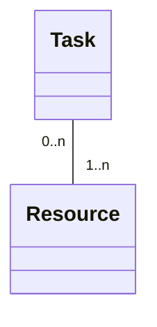
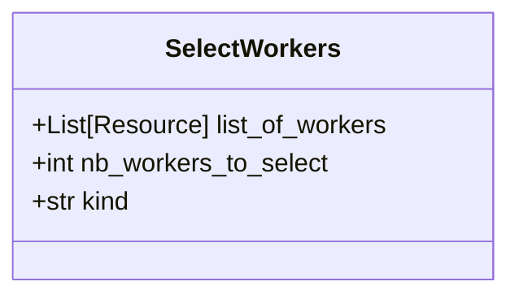
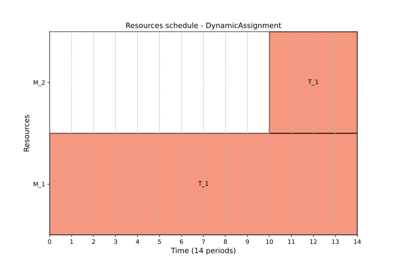

# Resource assignment

In the context of scheduling, resource assignment is the process of determining which resource or resources should be assigned to a task for its successful processing. ProcessScheduler provides flexible ways to specify resource assignments for tasks, depending on your scheduling needs. A `Worker` instance can process only one task per time period whereas a `CumulativeWorker` can process multiple tasks at the same time.

!!! note

    To assign a resource to a task, use the **add_required_resources** method of the `Task` class.

The semantics of the resource assignment is the creation of the relationship between any instance of the `Task` class and a `Resource`.



The most common case is that a finite number $n$ of workers are required to perform a set of $m$ tasks.

There are three ways to assign resource(s) to perform a task : single resource assignment, multiple resource assignement and alternative resource assignement.


## Single resource assignment

For assigning a single resource to a task, you can use the following syntax:

``` py
assemble_engine = FixedDurationTask(name='AssembleCarEngine',
                                    duration=10)
john = Worker(name='JohnBenis')

# the AssembleCarEngine can be processed by JohnBenis ONLY
assemble_engine.add_required_resource(john)
```

## Multiple resources assignment

To assign multiple resources to a single task, you can use the following approach:

``` py
paint_car = FixedDurationTask(name='PaintCar',
                              duration=13)

john = Worker(name='JohnBenis')
alice = Worker(name='AliceParker')

# the PaintCar task requires JohnBenis AND AliceParker
paint_engine.add_required_resources([john, alice])
```

All of the workers in the list are mandatory to perform the task. If ever one of the worker is not available, then the task cannot be scheduled.

## Alternative resource assignment

ProcessScheduler introduces the `SelectWorkers` class, which allows the solver to decide which resource(s) to assign to a task from a collection of capable workers. You can specify whether the solver should assign exactly $n$ resources, at most $n$ resources, or at least $n$ resources.


Let's consider the following example: 3 drillers are available, a drilling task can be processed by any of one of these 3 drillers. This can be represented as:

``` py
drilling_hole = FixedDurationTask(name='DrillHolePhi10mm',
                                  duration=10)
driller_1 = Worker(name='Driller1')
driller_2 = Worker(name='Driller2')
driller_3 = Worker(name='Driller3')

# the DrillHolePhi10mm task can be processed by the Driller1 OR
# the Driller2 OR the Driller 3
sw = SelectWorkers(list_of_workers=[driller_1, driller_2, driller_3],
                   nb_workers_to_select=1,
                   kind='exact')

drilling_hole.add_required_resource(sw)
```

In this case, the solver is instructed to assign exactly one resource from the list of three workers capable of performing the task. The `kind` parameter can be set to `'exact'` (default), `'min'`, or `'max'`, depending on your requirements. Additionally, you can specify the number of workers to select with `nb_workers_to_select`, which can be any integer between 1 (default value) and the total number of eligible workers in the list.

These resource assignment options provide flexibility and control over how tasks are allocated to available resources, ensuring efficient scheduling in various use cases.

## Dynamic assignment

The `add_required_resource` method includes an optional parameter named `dynamic`, which is set to `False` by default. When set to `True`, this parameter allows a resource to join the task at any point during its duration, from start to finish. This feature is particularly useful for tasks that demand a significant amount of work and could benefit from additional resources joining in to decrease the overall time required for completion.

Consider the example of a task, $T_1$, which has a total `work_amount` of 150. This task can be undertaken by two machines, $M_1$ and $M_2$. $M_1$ offers a lower productivity rate of 5 work units per period, in contrast to $M_2$, which is significantly more productive with a rate of 20 work units per period. The completion time for $T_1$ is initially unknown and depends on the machine assigned to it. Additionally, suppose that machine $M_2$ is unavailable until time instant 10. The current scenario can be depicted as follows:

``` py
pb = ps.SchedulingProblem(name="DynamicAssignment")

T_1 = ps.VariableDurationTask(name="T_1", work_amount=150)

M_1 = ps.Worker(name="M_1", productivity=5)
M_2 = ps.Worker(name="M_2", productivity=20)

T1.add_required_resources([M_1, M_2])
```

We get this result:

{ width="100%" }

In this case, the solver waits until both $M_1$ and $M_2$ are available before scheduling task $T_1$. A total of 6 time units are needed to complete the task, calculated as $6 \times 5 + 6 \times 20 = 150$.

Now, let's modify the scenario, allowing $M_2$ to join in processing $T_1$ as soon as it becomes available, even if the task has already started. This approach, known as "dynamic allocation," necessitates altering the assignment like so:

``` py
T1.add_required_resource(M_1)
T1.add_required_resource(M_2, dynamic=True)
```

To optimize the schedule, it's also necessary to enable the `ObjectiveMinimizeMakespan` optimization:

``` py
ps.ObjectiveMinimizeMakespan()
```

With these adjustments, the solution is as follows:

{ width="100%" }

The makespan is reduced to 14. Machine $M_1$ begins processing $T_1$ at the earliest opportunity (time 0), and machine $M_2$ joins the task at time 10 when it becomes available. The total work output remains at $150 = 14 * 5 + 4 * 20$.