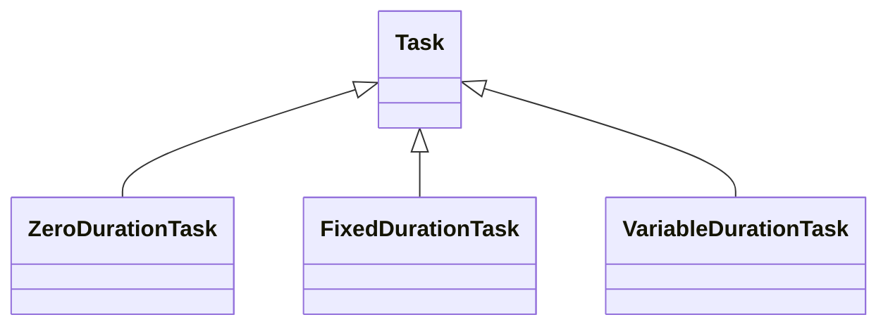

# Task

According to the [APICS dictionary](https://www.ascm.org/), a task may either be:

1. In project management, the lowest level to which work can be divided on a project

2. In activity-based cost accounting, a task, a subdivision of an activity, is the least amount of work. Tasks are used to describe activities.

In the context of this software library, the concept of a task aligns with the first definition. ProcessScheduler's primary objective is to compute a chronological sequence, or temporal order, for a collection of tasks while adhering to a specific set of constraints.

The inheritance class diagram is the following:

## Common base Task model

The `Task` class and its derivatives represent any task. A `Task` instance is defined by the three following parameters:

- `start`: a point in the $[0, horizon]$ integer interval. If the task is scheduled, then $start>=0$

- `end`: a point in the $[0, horizon]$ integer interval. If the task is scheduled, then $end>=start$ and $end<=horizon$

- `duration`: a integer number of periods, such as $duration=end-start$

{ width="80%" }

``` py
# Example: The duration of this task depends on the number
# of workers handling boxes.
move_boxes = VariableDurationTask(name='MoveBoxesFromMachineAToInventory')
```

!!! warning

    Each `Task` instance must have a unique name in the scheduling problem. To prevent that two tasks share the same name, ProcessScheduler raises an exception if ever a task with an existing name is already created.

Three `Task` derivative classes can be used to represent a task: `FixedDurationTask`, `ZeroDurationTask`, `VariableDurationTask`.

## FixedDurationTask class

The duration of a `FixedDurationTask` is known *a priori*. You must pass the task `name` and `duration` arguments when creating the instance:

``` py
# I assume one period to be mapped to 15min, cooking will be 1.5 hour
# so the chicken requires 6*15mn=1.5h to be cooked
cook_chicken = FixedDurationTask(name='CookChicken',
                                 duration=6)
```

## ZeroDurationTask class

A `ZeroDurationTask` is a FixedDurationTask where $duration=0$, that is to say $start=end$. Useful to represent project milestones, or other important points in time.

``` py
project_kickup = ZeroDurationTask(name='KickUp')
```

## VariableDurationTask class

A `VariableDurationTask` represents a task for which the duration is not known. The solver is expected to find a duration that satisfies the constraints (the duration may depend on the number of resources assigned to the task). You can bound the duration by using `max_duration` and/or `min_duration` parameters.

``` py
# 48h max to get done
plant_wheat_seeds = VariableDurationTask(name='PlantWheatSeeds',
                                         max_duration=48)
```

A `VariableDurationTask` duration can be selected among a list of possible durations. The solver decides the duration.

``` py
# either 1 or 2 hour for an english lesson
english_lesson = VariableDurationTask(name='EnglishLesson',
                                      allowed_durations = [1, 2])
```

## Advanced parameters

### Work amount

The `work_amount` is the total amount of work that the `Task` must provide. It is set to :const:`0` by default. The `work_amount` is a dimensionless positive integer value, it can be mapped to any unit according to the physical meaning of the work amount. For example, if the task target is to move small pieces of wood from one point to another, then the work_amount maybe 166000 if 166000 pieces of woods are to be moved. In a maintenance task, if there are 8 screws to unscrew, the UnScrew work_amount will be set to 8.

### Temporal priority

The `priority` of a task is a positive integer that can take any value. It is not bounded. A task with a higher priority will be scheduled earlier than a task with a lower priority. If the solver is requested to optimize the global schedule in terms of task priorities (a "priority objective") then a task with a high priority *may* be scheduled before a task with a lower priority.

### Optional

All tasks instances are mandatory by default: the solver has to find a solution where all tasks are actually scheduled. However, tasks instances can be turned into optional tasks, by setting the `optional` flag to `True`:

``` py
# 10mn to clean the table. This is an optional task
clean_the_table_after_meal = FixedDurationTasks(name='CleanTable',
                                                duration=10,
                                                optional=True)
```

An optional task may or may not be scheduled by the solver. It depends on the constraints that bound the scheduling problem.
